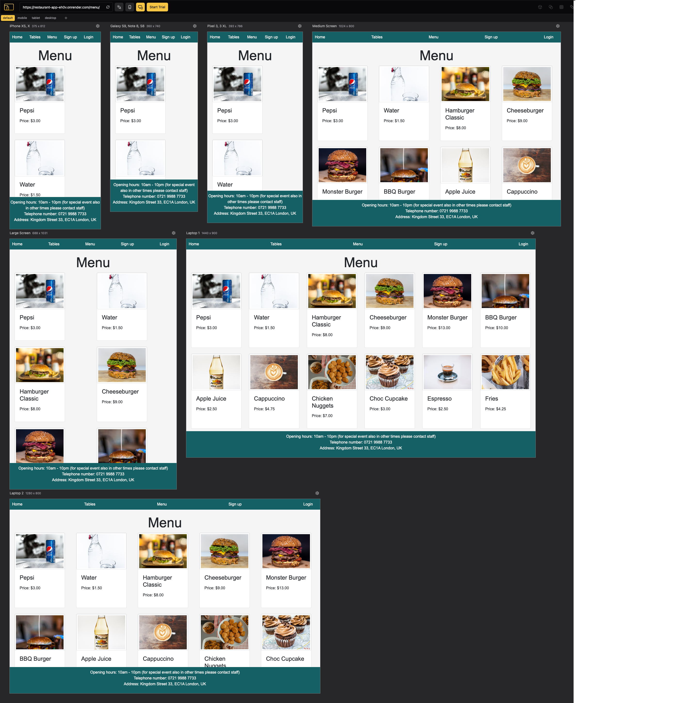

# Testing

## Manuel Testing

| Page             | User Actions                                     | Expected Results                                                                                 | Y/N | Comments                       |
|------------------|--------------------------------------------------|--------------------------------------------------------------------------------------------------|-----|---------------------------------|
| Home Page        | Open the home page                               | Page loads with clear options: "Book a Table," "View Menu," "Contact Info," and "Opening Hours."| Y   |                                |
|                  | Click on "Book a Table"                          | Redirects to the booking page                                                                   | Y   |                                |
|                  | Click on "View Menu"                             | Redirects to menu page with all items displayed                                                 | Y   |                                |
|                  | Check if "Opening Hours" section is visible      | Displays accurate opening hours                                                                | Y   |                                |
|                  | Verify "Contact Information" section             | Contact phone number and address are visible and accurate                                       | Y   |                                |
| Tables Page      | Open the "Tables" page                           | Loads with a list of tables showing number, capacity, and current availability status           | Y   |                                |
|                  | Verify table availability status                 | Displays correct status (Available/Occupied)                                                    | Y   |                                |
|                  | Click on an available table                      | Prompts user to log in if not authenticated                                                     | Y   |                                |
|                  | Attempt to view details on an occupied table     | Shows status as "Occupied" without option to book                                               | Y   |                                |
|                  | Verify display of restaurant opening hours       | Hours of operation are clearly displayed                                                       | Y   |                                |
|                  | Check for contact details on page                | Displays restaurant contact number and address                                                  | Y   |                                |
| Booking Process  | Select date and time for booking                 | Date and time selection available within restaurant operating hours                             | Y   |                                |
|                  | Attempt booking without selecting date/time      | Displays error message requiring date and time selection                                        | Y   |                                |
|                  | Confirm booking with valid date/time selection   | Shows booking confirmation message and booking summary                                          | Y   |                                |
| Menu Page        | Open "Menu" page                                 | Loads with a list of food and drink items, each with name, description, price, and image        | Y   |                                |
|                  | Click on menu item                               | Expands item details, showing additional description if available                               | Y   |                                |
|                  | Verify images load correctly for each item       | Each item has a properly loaded image                                                           | Y   |                                |
|                  | Verify all prices and descriptions are visible   | All items display names, descriptions, and prices                                               | Y   |                                |
| Sign Up Page     | Open "Sign Up" page                              | Displays fields for username, email, password, and password confirmation                        | Y   |                                |
|                  | Enter valid username                             | Field accepts up to 150 characters                                                             | Y   |                                |
|                  | Enter username with special characters           | Rejects input, displays error for invalid characters                                           | Y   |                                |
|                  | Enter valid email                                | Accepts input only in valid email format                                                        | Y   |                                |
|                  | Enter invalid email format                       | Displays error message for incorrect email format                                               | Y   |                                |
|                  | Enter valid password                             | Accepts secure password within criteria (8+ chars, alphanumeric, etc.)                          | Y   |                                |
|                  | Enter weak or short password                     | Displays error for insufficient password security                                               | Y   |                                |
|                  | Confirm password with mismatched entry           | Shows error indicating passwords must match                                                     | Y   |                                |
|                  | Click "Sign Up" with valid inputs                | Redirects to account confirmation page or welcome screen                                        | Y   |                                |
|                  | Click "Sign Up" with incomplete form             | Shows field-specific error messages                                                             | Y   |                                |
| Create Booking   | Open "Create Booking" page                       | Redirects to login page if not authenticated                                                    | Y   |                                |
|                  | Log in as authenticated user                     | Accesses the booking form page directly after login                                             | Y   |                                |
|                  | Select table from dropdown                       | Dropdown shows only available tables within selected time                                       | Y   |                                |
|                  | Enter guest count                                | Field validates input to stay within table capacity                                             | Y   |                                |
|                  | Click "Confirm Booking"                          | Success message shown; booking details saved to user account                                    | Y   |                                |
|                  | Attempt double-booking at same time              | Error displayed if table is unavailable at selected time                                        | Y   |                                |
| My Bookings      | Open "My Bookings" page                          | Redirects to login page if not authenticated                                                    | Y   |                                |
|                  | View list of bookings                            | All current bookings display with date, time, table, and guest count                            | Y   |                                |
|                  | Click "Edit" on a booking                        | Redirects to pre-filled edit form                                                               | Y   |                                |
|                  | Make and save changes to booking                 | Success message displayed; updated booking details shown                                        | Y   |                                |
|                  | Click "Cancel" on a booking                      | Prompts confirmation; removes booking upon confirmation                                         | Y   |                                |
|                  | Attempt to edit or cancel past booking           | Error or restriction prevents modifying past bookings                                           | Y   |                                |
| Login Page       | Open "Login" page                                | Page loads with fields for email/username and password                                         | Y   |                                |
|                  | Enter valid email and password                   | Redirects to user dashboard on successful login                                                 | Y   |                                |
|                  | Enter incorrect email/password                   | Displays error message for incorrect credentials                                                | Y   |                                |
|                  | Leave fields empty and attempt login             | Error message prompts user to fill required fields                                              | Y   |                                |
| Responsiveness   | Open each page on mobile                         | Layout adapts for smaller screens, all elements are accessible and readable                     | Y   | Verified across all pages      |
|                  | Verify functionality of interactive elements     | Buttons, dropdowns, and input fields are fully functional on mobile                             | Y   |                                |
|                  | Check "Menu" and "Tables" page on tablet         | Layout remains accessible and formatted for tablet screen size                                  | Y   |                                |

# User Stories Testing Table

| User Goals                          | Requirement Met                                                      | Image                 |
|-------------------------------------|----------------------------------------------------------------------|-----------------------|
| **First-Time Visitor Goals**        |                                                                      |                       |
| #1 - Clear and inviting homepage    | Homepage displays welcoming text, restaurant details, and clear navigation options |  |
| #2 - View table information         | "Tables" page shows seating capacity for each table                 |  |
| #3 - Browse food and drink menu     | "Menu" page lists food and drinks with descriptions, prices, and images |  |
| #4 - Create an account              | "Sign Up" page is accessible with form fields for new user registration |  |
| #5 - Make a new booking             | "Create Booking" page allows date, time, table selection for reservations |  |
| **Frequent User Goals**             |                                                                      |                       |
| #6 - Quick login access             | "Login" page available, login fields, and "Forgot Password?" option |  |
| #7 - View existing bookings         | "My Bookings" page displays list of reservations with edit/cancel options |  |
| #8 - Easily create a new booking    | "Create Booking" page available for new reservation                 |  |
| #9 - Browse menu regularly          | "Menu" page displays current food and drink items                   |  |
| **Restaurant Owner Goals**          |                                                                      |                       |
| #10 - Staff login access            | Separate staff login option available                               |  |
| #11 - View all tables               | Staff access to "Tables" page showing all table capacities          |  |
| #12 - Create/edit tables            | Staff can access options to create and modify tables                |  |
| #13 - View all bookings             | Staff access to "Bookings" page listing all reservations            |  |
| #14 - Edit food and drink menu      | Staff has options to edit items on "Menu" page                      |  |
| #15 - Add new menu items            | Staff can add new items on "Menu" page                              |  |
| #16 - Bookings in the past          | Staff able to create past bookings to record historical reservations |  |
| #17 - Special event bookings        | Staff can create bookings for special events outside regular hours  |  |

## Solved Bugs

 During development, I encountered various bugs that provided valuable learning experiences, helping me to grow and improve as a developer. One significant challenge was an issue where everything appeared to work fine in Debug mode, but disabling it led to access issues with the Admin Panel. This bug was particularly challenging to identify, as the debug mode masked the underlying issue, making it hard to troubleshoot.

Through persistent testing and analysis, I was able to trace the root cause of the problem and implement a solution, restoring full access to the Admin Panel when debug mode was off. Resolving this bug improved my understanding of production configurations and how certain issues might only surface outside the debug environment, reinforcing the importance of testing in real-world scenarios.

Each bug and subsequent fix has contributed to my development skills, allowing me to anticipate potential issues in future projects and manage configurations more effectively.

## Validation

### [HTML Validation](documentation/validation/html-validation.png)

- No errors or warnings were found when passing through the official [W3C](https://validator.w3.org/) validator. This checking was done manually by copying the view page source code (Ctrl+U) and pasting it into the validator.

### [CSS Validation](documentation/validation/css-validation.png) 

- No errors or warnings were found when passing through the official [W3C (Jigsaw)](https://jigsaw.w3.org/css-validator/#validate_by_uri) validator except for the warnings about the use of css root variables and webkits for the box-shadow. However, css code works perfectly on various devices.

### JS Validation

- No errors or warning messages were found when passing through the official [JSHint](https://www.jshint.com/) validator. 

### Python Validation

- No errors were found. According to the reports, the code is [Pep 8-compliant](https://legacy.python.org/dev/peps/pep-0008/). This checking was done manually by copying python code and pasting it into the validator.

## Lighthouse Reports

### Home Page

### Tables Page

### Menu Page

### Signup Page

### Login Page

### Create Booking Page

### My Bookings Page

## Compatibility Testing

The compatibility was tested via [PowerMapper](https://www.powermapper.com).

## Responsiveness

The responsiveness was checked manually by using devtools (Chrome) throughout the whole development. It was also checked with [Responsive Viewer](https://chrome.google.com/webstore/detail/responsive-viewer/inmopeiepgfljkpkidclfgbgbmfcennb/related?hl=en) Chrome extension.

### Home Page

### Tables Page

### Menu Page

### Sign Up Page

### Login Page

